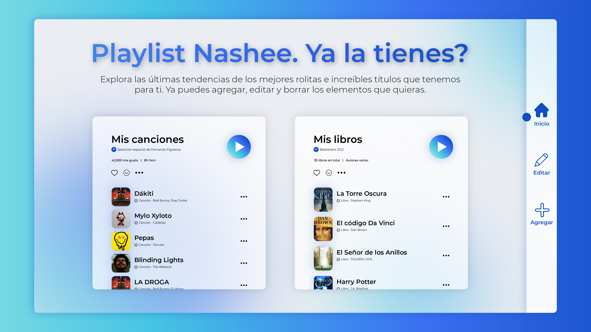
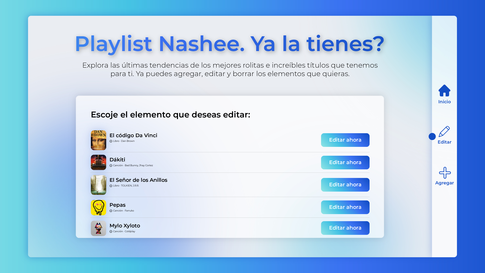

# Playlists de libros y canciones (documentación)
Realizar el back-end para realizar playlists de libros y canciones. Deberá incluir operaciones de tipo CRUD (Create, Read, Update, Delete). 

## _¿Cómo instalar los módulos necesarios?_
El proyecto esta construido con las dependencias de Node.js
Al iniciaizarlo, abrir una terminal dentro del repositorio principal e ingresar:
```sh
npm install 
```

Las dependencias de nuestro archivo serán instaladas con la última versión trabajada. Una vez hecho esto, dentro del mismo repositorio:
```sh
node index.js
```
Para correrlo.

## _Estructura del proyecto_
El proyecto se encuentra dividido en distintas carpetas. Es imperativo que cada una de ellas se encuentre en el repositorio/ubicación especificado a continuación:

- Controllers
- Public
  - css
  - images
  - js
- Routes
- src
- views
- Archivos individuales:
  - sequelizerc
  - index.js

Con lo anterior, se explica cada uno de ellos:

## _Controllers_
Esta misma cuenta con todos los controladores del sistema CRUD. Se enlistan cada uno de los archivos:
- cancionesController.js:
Cuenta con la función de lectura de canciones. Ella realiza un mapeo con el método findAll() proporcionado por el archivo JSON en nuestra base de datos.

Nuestra función de "createCancion", realiza una petición a nuestra instancia para agregar una canción a nuestra Playlist. Antes del proceso, verifica que no existan errores.

```sh
console.log(req.body); // <= {id: number, nombre: text}

            let errors = validationResult(req);

            if (errors.isEmpty()) {
            // No hay errores, seguimos adelante.
            await Canciones.findOne({where: {nombre: req.body.nombre}})
```

Continuando con el desarrollo del CRUD, el método de actualizarCancion sube los cambios en caso de realizar alguno. Muestra un mensaje de actualización para mejorar la experiencia de nuestro usuario:

```sh
await Canciones.update(req.body, {
                where: {
                    id: req.body.id
                }
            })
            .then(() => {
                console.log("Cancion actualizada");
                res.json({status: 200, estado: "Cancion actualizada"});
            })
```

Finalmente el método de borrar elimina el ID respectivo directamente de nuestra instancia:

```sh
await Canciones.update(req.body, {
  await Canciones.destroy({
                where: {
                    id: req.body.id
                }
            })
            .then(() => {
                console.log("Cancion eliminada");
                res.json({status: 200, estado: "Cancion eliminada"});
            })
```


- librosController.js:
Cuanta con las mismas funcionalidades de lectura, actualización, creación y borrado de nuestros elementos que componen la lista de libtos.

- playlistController.js:
Pasamos con el controlador de ambas listas. Cre un vínculo entre ambas (libros y canciones) para la lectura unificada:

```sh

const playlistController = {
        fullPlaylist: async (req, res) => {
            await Playlists.findAll({include: [
                {association: "cancion"},
                {association: "libro"}

```

Debido a que los métodos de ambas playlista se hicieron individualmente, fue necesario crear este controlador para la lectura de ambas y poder mostrar en nuestro front de una manera más sencilla.

Esta misma muestra el vínculo en un formato JSON:

```sh

                                    .then(playlist => {
                                        console.log(playlist);
                                        res.json(playlist);
                                    })
                                    .catch(error => console.log(error))

```

## _FRONT-END_

A continuación se muestra la Vista de lectura de ambas listas. Dicha view se encuentra programada en views--> main_page.html
En esta misma se despliegan los elementos con todos los atributos establecidos:

Vista uno: Lectura

[](https://github.com/tterb/atomic-design-ui/blob/master/LICENSEs)

Vista dos: actualización / edición 

[](https://github.com/tterb/atomic-design-ui/blob/master/LICENSEs)

Se crearon hojas de estilos unificadas y seperadas para la sobreescritura de Bootstrap 5.

## _Diagrama de relación de la base de datos_
El diagrama de las relaciones de las tablas de nuestra base de datos es el siguiente:

 Fer, te amo. :3 te necesito. Choose me.

En este se puede observar que si el id apunta a un libro el id de la canción será cero y viceversa.

# _Servicios_
A continuacion se enlistan los servicios realizados para la playlist, estos se dividen en servicios de:

- Playlist
- Canciones
- Libros


## _Playlist_
Para la platlist se realizo solo el servicio de Read para poder leer todas las canciones y los libros que existen en la playlist. Esta tabla puede ser considerada como tabla pivote ya que es la que contiene la relación con la tabla de canciones y la relación con la tabla de libros.

- Endpoint: /playlist
- Método: GET
- Respuesta: HTTP status 200 
```sh
{
    "status": 200,
    "playlist": [
        {
            "id": 2,
            "id_cancion": 1,
            "id_libro": 0,
            "cancion": {
                "id": 1,
                "nombre": "Te mudaste",
                "artista": "Bad Bunny",
                "album": "El Ultimo Tour Del Mundo",
                "duracion": "2:11",
                "genero": "Reggaeton",
                "año": 2020,
                "link_spotify": "https://open.spotify.com/track/5RubKOuDoPn5Kj5TLVxSxY?si=344ff5895ded446b"
            },
            "libro": null
        },
        {
            "id": 3,
            "id_cancion": 2,
            "id_libro": 0,
            "cancion": {
                "id": 2,
                "nombre": "El mundo es mío",
                "artista": "Bad Bunny",
                "album": "El Ultimo Tour Del Mundo",
                "duracion": "2:46",
                "genero": "Reggaeton",
                "año": 2020,
                "link_spotify": "https://open.spotify.com/track/36DHxTW2xdr9GG15T9oK9L?si=55fb46f86eaa49a4"
            },
            "libro": null
        },
        {
            "id": 4,
            "id_cancion": 0,
            "id_libro": 1,
            "cancion": null,
            "libro": {
                "id": 1,
                "titulo": "Dime quien soy",
                "autor": "Julio Navarro",
                "editorial": "Planeta",
                "año": 2010,
                "edicion": 1,
                "fotoPortada": "https://th.bing.com/th/id/OIP.1W1hg1sTvHelDtsUNfEA7wHaLH?w=123&h=184&c=7&r=0&o=5&pid=1.7"
            }
        },
        {
            "id": 5,
            "id_cancion": 0,
            "id_libro": 2,
            "cancion": null,
            "libro": {
                "id": 2,
                "titulo": "Persona Normal",
                "autor": "Benito Taibo",
                "editorial": "Planeta",
                "año": 2011,
                "edicion": 4,
                "fotoPortada": "https://th.bing.com/th/id/OIP.1W1hg1sTvHelDtsUNfEA7wHaLH?w=123&h=184&c=7&r=0&o=5&pid=1.7"
            }
        }
    ]
}
```
Se asocia la informacion de la tablas de canciones y libros para poder mostrarlas en el Front-end de una manera más sencilla. 

## _Canciones_
Los servicios de la tabla de canciones son los cuatro del CRUD. Se describen a continuación:

### _Obtener todas las canciones_
Este servicio obtiene todas las canciones existentes en la playlist y las entrega en un arreglo de todas las canciones.

- Endpoint: /playlist/canciones
- Método: GET
- Respuesta: HTTP status 200
```sh
{
    "status": 200,
    "canciones": [
        {
            "id": 1,
            "nombre": "Te mudaste",
            "artista": "Bad Bunny",
            "album": "El Ultimo Tour Del Mundo",
            "duracion": "2:11",
            "genero": "Reggaeton",
            "año": 2020,
            "link_spotify": "https://open.spotify.com/track/5RubKOuDoPn5Kj5TLVxSxY?si=344ff5895ded446b"
        },
        {
            "id": 2,
            "nombre": "El mundo es mío",
            "artista": "Bad Bunny",
            "album": "El Ultimo Tour Del Mundo",
            "duracion": "2:46",
            "genero": "Reggaeton",
            "año": 2020,
            "link_spotify": "https://open.spotify.com/track/36DHxTW2xdr9GG15T9oK9L?si=55fb46f86eaa49a4"
        }
    ]
}
```

### _Añadir una canción nueva a la playlist_

| Color             | Hex                                                                |
| ----------------- | ------------------------------------------------------------------ |
| Example Color |  #0a192f |
| Example Color |  #f8f8f8 |
| Example Color |  #00b48a |
| Example Color |  #00d1a0 |

### _Actualizar una canción de la playlist_
### _Borrar una canción de la playlist_

## _Libros_
Los servicios de la tabla de libros son los cuatro del CRUD. Se describen a continuación:

### _Obtener todos los libros_
Este servicio obtiene todos los libros existentes en la playlist y las entrega en un arreglo de todos los libros.

- Endpoint: /playlist/libros
- Método: GET
- Respuesta: HTTP status 200
```sh
{
    "status": 200,
    "libros": [
        {
            "id": 1,
            "titulo": "Dime quien soy",
            "autor": "Julio Navarro",
            "editorial": "Planeta",
            "año": 2010,
            "edicion": 1,
            "fotoPortada": "https://th.bing.com/th/id/OIP.1W1hg1sTvHelDtsUNfEA7wHaLH?w=123&h=184&c=7&r=0&o=5&pid=1.7"
        },
        {
            "id": 2,
            "titulo": "Persona Normal",
            "autor": "Benito Taibo",
            "editorial": "Planeta",
            "año": 2011,
            "edicion": 4,
            "fotoPortada": "https://th.bing.com/th/id/OIP.1W1hg1sTvHelDtsUNfEA7wHaLH?w=123&h=184&c=7&r=0&o=5&pid=1.7"
        }
    ]
}
```

### _Añadir un libro nuevo a la playlist_
Este servicio permite al usuario añadir un nuevo libro a la playlist, al utilizar este servicio se crea el registro con toda la información del libro en la tabla de libros al igual que se añade el apuntador del nuevo libro en la tabla playlist.

- Endpoint: /playlist/libros/agregar
- Método: POST
- Body: 
```sh
{
    "titulo": "Pers",
    "autor": "Ben",
    "editorial": "Planeta",
    "año": 2011,
    "edicion": 4,
    "fotoPortada": "https://th.bing.com/th/id/OIP.1W1hg1sTvHelDtsUNfEA7wHaLH?w=123&h=184&c=7&r=0&o=5&pid=1.7"
}
```
- Validaciones:
| Campo             | Validación                                                                |
| ----------------- | ------------------------------------------------------------------ |
| titulo | No puede estar vacio. |
| autor | No puede estar vacio. |
| editorial | No puede estar vacío. |
| año | No puede estar vacio. Debe de ser de al menos 4 caracteres. Debe de ser numérico. |
| edicion | No puede estar vacio. Debe de ser numérico. |
| fotoPortada | No puede estar vacío. |

- Errores:
| Código             | Mensaje                                                                | HTTP |
| ----------------- | ------------------------------------------------------------------ |------------|
| InvalidBodyException | Debes de colocar el titulo del libro | 422 |
| InvalidBodyException | Debes de ingresar un valor numérico | 422 |
| InvalidBodyException | Debes ingresar un año valido (4 caracteres) | 422 |

- Respuesta: HTTP status 201
```sh
{
    "status": 201,
    "estado": "Libro creado"
}
```
-Respuesta con error: 
```
{
    "status": 400,
    "errors": {
        "errors": [
            {
                "value": "",
                "msg": "Debes de colocar el título del libro",
                "param": "titulo",
                "location": "body"
            },
            {
                "value": "",
                "msg": "Debes de colocar el autor del libro",
                "param": "autor",
                "location": "body"
            },
            {
                "value": "",
                "msg": "Debes de colocar una editorial",
                "param": "editorial",
                "location": "body"
            },
            {
                "value": 201,
                "msg": "Debes ingresar un año valido (4 caracteres)",
                "param": "año",
                "location": "body"
            },
            {
                "value": "3r",
                "msg": "Debes de ingresar un valor numérico",
                "param": "edicion",
                "location": "body"
            },
            {
                "value": "",
                "msg": "Debes de colocar el link de la foto",
                "param": "fotoPortada",
                "location": "body"
            }
        ]
    }
}
```


### _Actualizar un libro de la playlist_
### _Borrar un libro de la playlist_

## _Seguridad_
Las credenciales de nuestro proyecto se encuentran ubicadas en la carpeta de stc/database.
Con el fin de no ser mostradas tan fácilmente, estas se esconden en el archivo config.js para ser llamas como una función posteriormente:

```sh
module.exports = {
  "development": {
    "username": "user5",
    "password": "****",
    "database": "Base_Nashe",
    "host": "18.234.222.26",
    "dialect": "mysql"
  },
  "test": {
    "username": "user5",
    "password": "****",
    "database": "Base_Nashe",
    "host": "18.234.222.26",
    "dialect": "mysql"
  },
  "production": {
    "username": "user5",
    "password": "****",
    "database": "Base_Nashe",
    "host": "18.234.222.26",
    "dialect": "mysql"
  }
}

```

Mediante el módulo de .sequelizerc:

```javascript
const path = require('path')
module.exports = {
config: path.resolve('./src/database/config', 'config.js'),
'models-path': path.resolve('./src/database/models'),
'seeders-path': path.resolve('./src/database/seeders'),
'migrations-path': path.resolve('./src/database/migrations'),
}

```


## _Index_
- Genera nuestro servidor:

```javascript
const express = require('express');
const path = require('path');
const { Sequelize } = require('sequelize'); //Conexión base de datos
const userConfigDB = require('./src/database/config/config');
const db = require('./src/database/models
```


- Llama a nuestro MVC:
```javascript
app.engine('html',require('ejs').renderFile);
app.set('view engine','ejs');
app.use('/playlist', playlistRouter);
```

- Establace conexión con base de datos:

```javascript
const checkConectionDB = async () => {
    const userConfigDB_Development = userConfigDB.development
    const sequelize = new Sequelize(userConfigDB_Development.database, userConfigDB_Development.username, userConfigDB_Development.password, {
      host: userConfigDB_Development.host,
      port: userConfigDB_Development.port,
      dialect: userConfigDB_Development.dialect
    })
    try {
      await sequelize.authenticate()
      console.log('Connection to MySQL DataBase has been established successfully');
    } catch (error) {
      console.error('Unable to connect to the database: ', error)
    }
  };
  
  checkConectionDB();
  ```